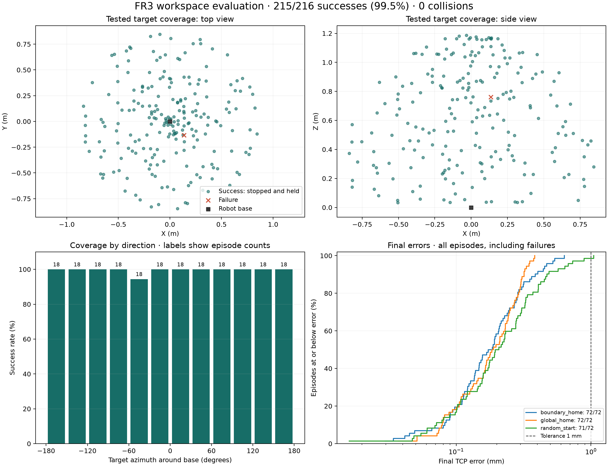

# Phase 3.2 – Franka FR3 and DQN

In this part I worked on reaching a target more accurately and testing targets across a wider area. I used the seven-joint Franka FR3 model in MuJoCo. The target is given as X, Y and Z coordinates in metres.

## How it works

The controller combines a planner with Double DQN. The planner uses inverse kinematics to find joint positions for the target, checks the path and divides it into smaller movements. DQN then chooses which joint to move and in which direction. There are 15 actions: a positive or negative movement for each of the seven joints, or holding the current command. A collision check filters the commands before they are applied.

DQN controls movement between intermediate positions. It does not find the whole path on its own. The planner also has RRT-Connect for cases where a straight path in joint space is blocked. It was not needed in the saved 216-task test.

For training, I first collected examples from a simulation teacher and then used Double DQN updates. The saved model was trained with 6,744 transitions from 160 episodes. The network has 12 input features per action and two hidden layers with 64 neurons each. The teacher is used during training, not when running the trained controller.

## Results

To finish a task, the end point of the arm (TCP) must be within **1 mm of the target**, moving at no more than **5 mm/s**, for at least **0.3 seconds**. The time limit is 30 seconds of simulation.

The final test contains 216 tasks: 72 targets from the home position, 72 near the workspace boundaries and 72 with different starting positions. These tasks were not used to select the model.

| Controller | Targets reached | Mean final error | Collisions |
|---|---:|---:|---:|
| Previous local DQN | 100/216 | 319.30 mm | 10 |
| Planner + Double DQN | 215/216 | 0.22 mm | 0 |

The new controller reached **99.54%** of the targets. One task timed out with an error of 1.051 mm. That failure is included in the results. This compares complete controllers, so the improvement cannot be credited to DQN alone. The previous local model also used Double DQN and teacher examples; it is not a vanilla DQN baseline.

Targets cover 12 direction sectors, different heights and distances. This is a sample of the workspace, not a guarantee for every possible point. The TCP stays at least 3 cm above the floor. That is a workspace restriction, not the reaching tolerance. The task generation method is described in [BENCHMARK.md](results/workspace/BENCHMARK.md).



## Movement example

The [robot animation](results/workspace/visualization/robot_replay.gif) shows task 216, the longest successful task in the saved test. It took 24.65 seconds in simulation and finished with an error of about 0.41 mm. The replay is sped up, with pauses at the start and end.

The fixed target is marked in green. The end of the arm (TCP) is marked in blue. The blue line shows the path already travelled. The labels remain visible when the robot blocks the target from view. The markers are enlarged and do not show the 1 mm tolerance.

On the right, the animation shows the distance to the target and views from above and from the side. Orange marks the start. Grey shows the complete recorded trajectory and blue shows the part already travelled. The grey line is a recording, not the path proposed by the planner. The final message means “Target reached” and comes from the saved test result.

[View the first frame](results/workspace/visualization/robot_replay_start.png).

The [interactive view](results/workspace/visualization/workspace_viewer.html) includes all 216 targets and 23 selected trajectories, including the failed task. Download the HTML file and open it in a browser to change the view and play the movements. GitHub displays the HTML source rather than running it.

## Running the project

I used Linux, Python 3.12, MuJoCo 3.10 and PyTorch 2.13. A GPU is not required. Run these commands from the main repository folder:

```bash
python3 -m venv Faza3_2/.venv
Faza3_2/.venv/bin/python -m pip install -r Faza3_2/requirements.txt
bash Faza3_2/run_workspace_demo.sh
```

The trained model is included. The demo shows 12 selected successful tasks, not the full test. The simulation resets to the starting position between tasks. To enter a target manually:

```bash
Faza3_2/.venv/bin/python Faza3_2/code/run_workspace_dqn.py \
  --goal -0.45 0.25 0.55 --viewer
```

To repeat all 216 tasks without a window:

```bash
OMP_NUM_THREADS=1 Faza3_2/.venv/bin/python Faza3_2/code/run_workspace_dqn.py \
  --tasks Faza3_2/results/workspace/test_tasks.json \
  --output Faza3_2/results/workspace/hybrid_test_repeat.json
```

Use a new output name to keep the saved results. To train a new model:

```bash
OMP_NUM_THREADS=1 Faza3_2/.venv/bin/python Faza3_2/code/train_joint_waypoint_dqn.py \
  --output Faza3_2/results/workspace/joint_run_002
```

To run the automatic checks:

```bash
OMP_NUM_THREADS=1 Faza3_2/.venv/bin/python -m unittest discover -s Faza3_2/tests -v
```

## Where to start reading the code

The files use the same basic layout as Phase 3: settings, environment, network, training and evaluation. They are kept separate because the FR3 controller also needs a planner.

1. [run_workspace_dqn.py](code/run_workspace_dqn.py) – starts a task, requests a path, selects actions and checks the result.
2. [joint_waypoint_dqn.py](code/joint_waypoint_dqn.py) – defines the network, the 15 actions, input features and simulation teacher.
3. [train_joint_waypoint_dqn.py](code/train_joint_waypoint_dqn.py) – collects examples and trains the network. Training settings are at the top.
4. [precision_environment.py](code/precision_environment.py) – runs the robot physics and checks distance, speed, holding time and collisions.
5. [workspace_planner.py](code/workspace_planner.py) – finds joint positions and checks the path to them.

The benchmark and visualization scripts prepare tasks and display results. They do not select the robot's actions. `precision_dqn.py` contains the earlier local network used for comparison. Trained weights and measurements are in `results/workspace/`.

## What is still missing

So far I have tested the controller only in simulation. It reaches an XYZ position but does not control the gripper orientation. The tests did not include new external obstacles, tool loads, sensor noise or communication delays. Gravity compensation is ideal. The 1 mm result is therefore not a measured accuracy of a real robot. Hardware use would need a robot interface, calibration and checks of the motion limits.

## Why I chose this approach

A basic DQN would be simpler to implement. The harder part would be training it to find the whole movement sequence without a planner and then stop within 1 mm. It would need to learn long sequences of actions from different starting positions while respecting the robot's limits. I expect that to require more training and tuning, but I have not measured how much more.

The planner breaks that problem into smaller movements, which DQN learns to control. Double DQN itself is a small change to DQN training that helps reduce overestimated action values. The bigger differences here are the planner and the training examples.

For this stage, this gives me a working controller that I can demonstrate and test. I can also explain which part is planned and which part is learned. A basic DQN might reach a similar result, but that needs a separate training experiment and a comparison under the same conditions. I cannot claim the same 99.54% result for it yet.
