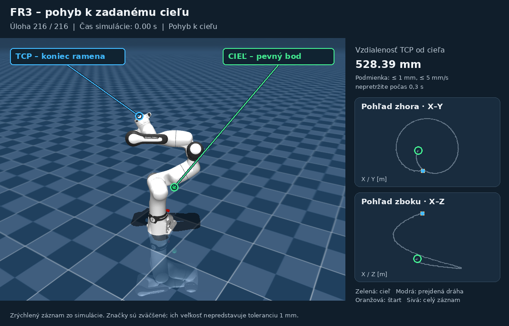

# Fáza 3.2 – Franka FR3 a DQN

V tejto časti som riešil, aby robot dosiahol zadaný bod presnejšie a zvládal ciele v rôznych častiach pracovnej oblasti. Pracoval som s modelom Franka FR3 v MuJoCo. Cieľ sa zadáva súradnicami X, Y, Z v metroch.

## Ako to funguje

Použil som Double DQN spolu s plánovačom. Plánovač najprv pomocou inverznej kinematiky vypočíta polohu kĺbov pre daný cieľ a cestu rozdelí na menšie kroky. DQN potom rozhoduje, ktorým kĺbom a ktorým smerom robot pohne. Má 15 možností: pohyb každého zo siedmich kĺbov v oboch smeroch alebo držanie polohy. Pred vykonaním príkazu sa ešte kontroluje možná kolízia.

DQN teda riadi pohyb medzi medzipolohami, ale celú cestu neplánuje sám. V kóde je aj RRT-Connect pre prípad, keď priama cesta nevyhovuje. Pri uložených 216 testoch však nebol potrebný.

Pri učení som použil ukážky pohybov zo simulácie a potom tréning Double DQN. Zo 160 epizód sa získalo 6744 prechodov. Sieť má 12 vstupných príznakov na akciu a dve skryté vrstvy po 64 neurónov. Pri spustení už vyberá akcie naučená sieť, bez simulovaného učiteľa.

## Čo sa podarilo

Robot musí dostať koncový bod ramena do vzdialenosti najviac **1 mm od cieľa**. Zároveň sa musí spomaliť pod stanovenú hranicu 5 mm/s a zostať v tejto tolerancii aspoň 0,3 s. Na jednu úlohu má 30 s simulácie.

Otestoval som 216 úloh: 72 cieľov z domácej polohy, 72 pri hraniciach oblasti a 72 s rôznymi štartovacími polohami. Tieto úlohy sa nepoužili na výber modelu.

| Riešenie | Dosiahnuté ciele | Priemerná konečná chyba | Kolízie |
|---|---:|---:|---:|
| Predchádzajúci lokálny DQN | 100/216 | 319,30 mm | 10 |
| Plánovač + Double DQN | 215/216 | 0,22 mm | 0 |

Úspešnosť nového riešenia bola **99,54 %**. Jedna úloha sa nestihla dokončiť v limite a skončila s chybou 1,051 mm. Aj tento neúspech je započítaný vo výsledkoch. Porovnávam tu celé riešenia, takže zlepšenie nie je iba zásluhou samotného DQN.

Ciele sú rozložené do 12 smerových sektorov a do rôznych výšok a vzdialeností. Test nepokrýva každý možný bod, ale dáva lepšiu predstavu o správaní robota mimo okolia domácej polohy. Koncový bod zostáva aspoň 3 cm nad podlahou; to je obmedzenie pracovnej oblasti, nie tolerancia cieľa. Podrobnosti výberu úloh sú v [BENCHMARK.md](results/workspace/BENCHMARK.md).


## Ukážky pohybu

[Animácia robota](results/workspace/visualization/robot_replay.gif) ukazuje jednu uloženú úlohu od štartu až po dosiahnutie cieľa. Je to úloha č. 216, najdlhšia úspešná v tomto teste. V simulácii trvala 24,65 s a skončila s chybou približne 0,41 mm. Prehrávanie je zrýchlené, so zastavením na začiatku a na konci.

Zelená značka **CIEĽ** označuje pevný bod, ku ktorému sa má robot dostať. Modrá značka **TCP** ukazuje aktuálny koniec ramena a modrá čiara jeho prejdenú dráhu. Značky majú popisy, aby boli viditeľné aj vtedy, keď cieľ zakrýva robot. Ich veľkosť neukazuje toleranciu 1 mm.

Vpravo je aktuálna vzdialenosť od cieľa a dva menšie pohľady: zhora a zboku. Oranžový bod označuje štart, sivá čiara celú zaznamenanú trajektóriu a modrá jej už prejdenú časť. Sivá čiara teda nie je cesta navrhnutá plánovačom. Na konci sa zobrazí „Cieľ dosiahnutý“ podľa výsledku uloženého testu.



V [interaktívnej vizualizácii](results/workspace/visualization/workspace_viewer.html) sú všetky testované ciele a 23 vybraných trajektórií vrátane neúspešnej. Dá sa meniť pohľad a prehrávať pohyb. HTML treba po stiahnutí otvoriť v prehliadači, priamo na GitHube sa zobrazuje len jeho kód.

## Spustenie

Použil som Linux, Python 3.12, MuJoCo 3.10 a PyTorch 2.13. GPU nie je potrebné. Príkazy sa spúšťajú z hlavného priečinka repozitára:

```bash
python3 -m venv Faza3_2/.venv
Faza3_2/.venv/bin/python -m pip install -r Faza3_2/requirements.txt
bash Faza3_2/run_workspace_demo.sh
```

Natrénovaný model je už uložený. Demo zobrazí 12 vybraných úspešných úloh; nejde o celý test. Medzi úlohami sa simulácia resetuje na štartovaciu polohu. Vlastný cieľ sa dá zadať takto:

```bash
Faza3_2/.venv/bin/python Faza3_2/code/run_workspace_dqn.py \
  --goal -0.45 0.25 0.55 --viewer
```

Na opakovanie všetkých 216 úloh bez okna:

```bash
OMP_NUM_THREADS=1 Faza3_2/.venv/bin/python Faza3_2/code/run_workspace_dqn.py \
  --tasks Faza3_2/results/workspace/test_tasks.json \
  --output Faza3_2/results/workspace/hybrid_test_repeat.json
```

Výstup musí mať nový názov, aby sa neprepísali uložené výsledky. Zdrojový kód je v `code/`, merania a model v `results/workspace/`. Skript `train_joint_waypoint_dqn.py` slúži na nové učenie. Automatické kontroly sa spúšťajú príkazom:

```bash
OMP_NUM_THREADS=1 Faza3_2/.venv/bin/python -m unittest discover -s Faza3_2/tests -v
```

## Čo ešte zostáva

Zatiaľ som riešenie overil iba v simulácii. Robot dosahuje polohu XYZ, ale nerieši požadovanú orientáciu uchopovača. Testy neobsahovali nové vonkajšie prekážky, záťaž nástroja ani šum a oneskorenie snímačov. Používa sa ideálna kompenzácia gravitácie. Výsledok 1 mm preto zatiaľ nemôžem preniesť ako tvrdenie o presnosti reálneho robota. Ďalším krokom by bolo doplniť pripojenie k robotu, kalibráciu a overenie pohybových limitov.

## Prečo som zvolil toto riešenie

Samotný bežný DQN by bol jednoduchší na naprogramovanie. Náročnejšie by však bolo naučiť ho, aby bez plánovača sám našiel celý postup pohybu k vzdialenému cieľu a nakoniec zastavil s presnosťou 1 mm. Musel by zvládnuť dlhé postupnosti akcií, rôzne štartovacie polohy aj obmedzenia robota. Očakávam preto náročnejšie učenie a ladenie, ale zatiaľ nemám meranie, z ktorého by sa dalo povedať, koľkonásobne náročnejšie by to bolo.

V súčasnom riešení plánovač rozdelí túto úlohu na menšie časti a DQN sa učí riadiť pohyb medzi nimi. Double DQN je pritom iba menšia úprava učenia oproti DQN, ktorá pomáha obmedziť nadhodnocovanie akcií. Najväčší rozdiel oproti samostatnému DQN je pomoc plánovača a učenie na ukážkach, nie samotné slovo „Double“.

Pre túto fázu mi tento postup dáva zmysel: mám funkčné riadenie, viem ho predviesť a jeho výsledky sú overené na uložených úlohách. Zároveň je jasné, ktorú časť rieši plánovač a ktorú naučená sieť. Neznamená to, že obyčajný DQN nemôže dosiahnuť podobný výsledok. To by bolo potrebné overiť samostatným tréningom a porovnaním za rovnakých podmienok; výsledok 99,54 % mu zatiaľ nemôžem sľúbiť.
