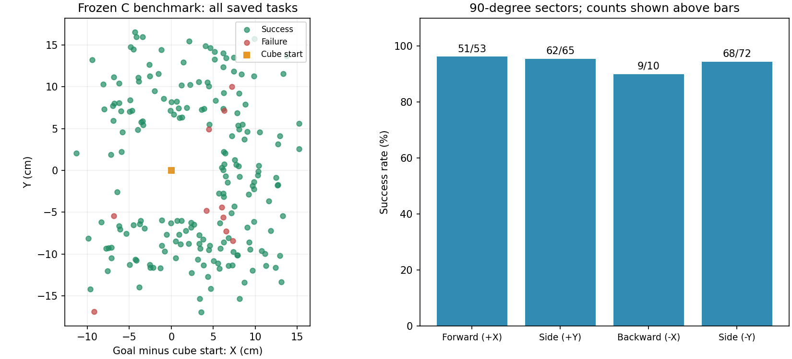
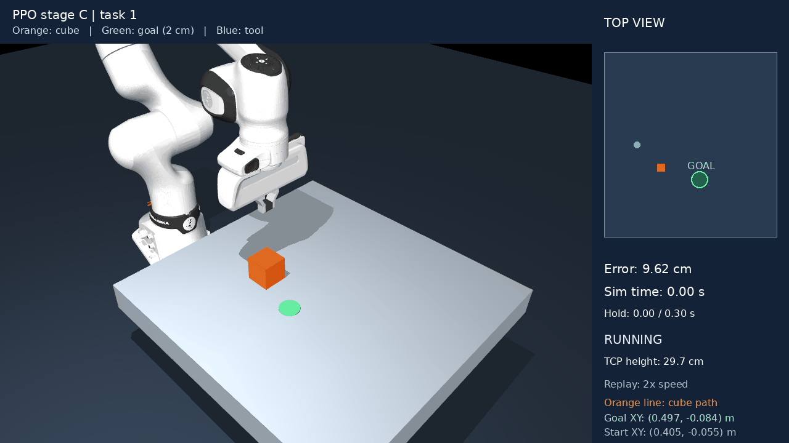

# Phase 4 — Pushing a cube with PPO

In this phase, the Franka FR3 pushes a cube to a target on a table in MuJoCo. Both the cube start and the target change between attempts. The hand has closed fingers, so the task is pushing rather than picking up the object.

This folder contains the final version from experiment Faza4_15. The trained model, environment, controller and training code are unchanged. Intermediate checkpoints, unused diagnostic tools and old logs are omitted. Everything needed to run the model is included here.

## How it works

The policy uses standard PPO from Stable-Baselines3. It receives 19 numbers describing the relative positions, velocities, tool tracking error and cube orientation. It produces three continuous actions for X, Y and Z.

Each action changes the tool target by up to 5 mm in X/Y and 4 mm in Z. A local inverse-kinematics controller converts that target into seven joint positions while keeping the hand orientation fixed. MuJoCo then calculates movement and contact. Actions are updated at 20 Hz, with a 0.002 s physics step.

The reward encourages moving the cube towards the goal and approaching from the opposite side. A further penalty discourages a high approach near the cube, starting at TCP height 0.207 m. Finger contact above 0.213 m, or contact mainly from above, ends the attempt. This is a reward hint and a task rule, not a predefined movement sequence.

The cube starts within X = 0.40–0.50 m and Y = ±0.06 m. Goals are within X = 0.38–0.56 m and Y = ±0.12 m, at least 6 cm from the initial cube position. This is a small workspace, not the full reach of the robot.

## Result

Success means the cube centre stays less than **2 cm** from the goal in XY for **0.3 seconds**, without an invalid contact. The time limit is 25 seconds of simulation.

| Measurement | Result |
|---|---:|
| Successful attempts | **190/200 — 95.0%** |
| Mean final error, all attempts | 1.41 cm |
| Median final error | 0.88 cm |
| Standard deviation of final error | 2.59 cm |
| Mean time to success, successful attempts only | 2.72 s |
| Failed attempts | 9 high contacts, 1 timeout |

The model was frozen before the final 200 tasks were generated. Test seeds are 960623–960822; validation used 10000–10199. All failures are included. The saved parent model reached 186/200 on these same tasks; the final model gained eight successes and lost four.

[Summary](results/summary.json) · [All task measurements](results/metrics.csv) · [Saved tasks](results/tasks.json) · [Parent measurements](results/reference_summary.json)



The result comes from one continued training run in simulation. It does not establish real-robot accuracy or the same success rate outside this workspace. The comparison combines more training with a changed reward, so it does not isolate the effect of the reward alone.

## Movement examples



Orange is the cube and its recorded path, green is the goal, and blue is the tool. The side panel shows a top view, goal error, hold time and TCP height. The animation runs at approximately twice simulation speed, with pauses at the start and end.

[Failed attempt](results/failure.gif) · [Three trajectories](results/trajectories.png) · [Tool height](results/tcp_height.png)

These are individual examples. The 95% result is calculated from all 200 attempts.

## Running

Tested on Linux with Python 3.12 and CPU PyTorch. From the repository root:

```bash
bash Faza4/setup.sh
bash Faza4/run_demo.sh
```

The demo loads the included final model and opens the MuJoCo viewer. Close the window to stop. It does not train the model.

To repeat the saved 200-task test without a window:

```bash
bash Faza4/run_test.sh
```

Results go into a new folder under `Faza4/runs/`, including `summary.json`, per-task measurements and plots. This repeats the existing benchmark; it is not a new independent test. Existing results are not overwritten.

## Training

The final experiment continued the included parent checkpoint for 1.5 million requested steps. PPO used four environments, learning rate 0.0001, rollout length 2048 per environment, batch size 64 and 10 epochs. The policy and value networks each have two 64-unit layers.

Checkpoints were selected by validation success, then mean error. The selected checkpoint was at 409,600 additional steps and reached 94.5% on validation. The full run collected 1,507,328 steps, but its last checkpoint was not the best one.

[Training curves](results/training_history.png) · [Original configuration](results/training_config.json) · [Selected checkpoint](results/best.json) · [Validation measurements](results/validation.csv)

To start a new continuation from the same parent:

```bash
bash Faza4/train.sh
```

This writes to a new directory under `runs/` and keeps the submitted model unchanged. It saves checkpoints and a local `progress.html` with learning curves. A new training run is not guaranteed to reproduce exactly 95%. The saved configuration describes the original experiment, so its absolute paths refer to that original folder. The launch scripts here use only files inside this folder.

## Code

| File | Purpose |
|---|---|
| [settings.py](code/settings.py) | Task limits, reward weights and PPO parameters |
| [pushing_env.py](code/pushing_env.py) | Reset, observations, physics, rewards and episode endings |
| [tcp_controller.py](code/tcp_controller.py) | Tool commands and inverse kinematics |
| [train_pushing_ppo.py](code/train_pushing_ppo.py) | PPO training and validation checkpoint selection |
| [run_pushing_demo.py](code/run_pushing_demo.py) | Viewer and video rendering |
| [evaluate_pushing_ppo.py](code/evaluate_pushing_ppo.py) | Frozen-model evaluation and saved measurements |
| [plot_pushing_results.py](code/plot_pushing_results.py) | Training and test plots |
| [check_side_goals.py](code/check_side_goals.py) | Seven small side-goal checks used during training |

`models/ppo_pushing.zip` is the submitted model. `reference/faza14.zip` is only the starting point for a new training run. `mujoco/` contains the scene, required robot meshes and their source/license information. Cameras, real-robot control and letter assembly are not implemented in this phase.
